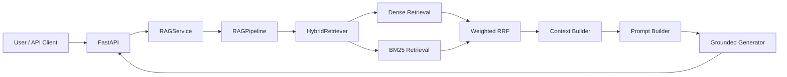

# Enterprise Knowledge Intelligence Platform
A production-minded Retrieval-Augmented Generation (RAG) platform for searching and reasoning over technical documentation across AI, ML, cloud, and software engineering ecosystems.

I built Enterprise KIP as an end-to-end AI engineering system covering ingestion, chunking, embeddings, hybrid retrieval, grounded generation, evaluation, API serving, observability, CI, and cloud deployment. Retrieval and deployment decisions are backed by benchmarks rather than chosen by intuition.

**v1.0.0 highlights:** Weighted RRF reached **0.7247 MRR** and **0.9300 Hit@10** on the 100-query retrieval benchmark. The cloud retrieval profile preserved **0.9300 Hit@10**, reproduced local BM25 ranking with **100/100 exact top-10 parity** in the parity canary, and runs from a **~130.5 MB** deployment image.

## Live Demo

- Public API: https://enterprise-kip-api.onrender.com
- Interactive Swagger UI: https://enterprise-kip-api.onrender.com/docs
- Liveness: https://enterprise-kip-api.onrender.com/health
- Readiness: https://enterprise-kip-api.onrender.com/ready

> The public service runs on a free-tier deployment, so occasional platform cold starts or transport variability may occur.

## Try the Live API

The public demo searches a curated corpus of technical documentation, so it is designed to answer questions grounded in the indexed sources rather than general-purpose questions.

You can try these examples directly from the [Swagger UI](https://enterprise-kip-api.onrender.com/docs):

- **Docker:** What is Docker BuildKit and how is it used during image builds?
- **Kubernetes:** What does `kubectl apply` do?
- **Version-specific:** What should Kubernetes users consider when moving from KMS v1 to KMS v2?

Open `POST /v1/query`, click **Try it out**, choose an example, and execute the request.

## What Makes This Project Different

- **Benchmark-driven retrieval** instead of choosing a retriever by intuition.
- **Dense + BM25 hybrid search** fused with Weighted Reciprocal Rank Fusion (RRF).
- **Exact BM25-compatible sparse retrieval in the cloud** without loading the full corpus or `rank_bm25` at runtime.
- **Two runtime profiles**: a full local production-style stack and a lightweight cloud deployment profile.
- **Grounded generation with citations** and explicit insufficient-evidence behavior.
- **Production hardening**: readiness checks, timeouts, bounded generation concurrency, admission control, request IDs, metrics, and dependency error normalization.
- **Public deployment** validated end-to-end on Render + Qdrant Cloud + Groq.

## Architecture



The application supports two runtime profiles:

| Component | Local profile | Cloud profile |
|---|---|---|
| API | FastAPI | FastAPI |
| Dense encoder | SentenceTransformers BGE | FastEmbed BGE |
| Dense index | Local Qdrant | Qdrant Cloud |
| Lexical retrieval | `rank_bm25` | Qdrant sparse vectors |
| Fusion | Weighted RRF | Weighted RRF |
| Generator | Ollama | Groq |
| Model | `qwen3:4b-instruct` | `openai/gpt-oss-20b` |
| Deployment | Docker Compose | Render |

Detailed architecture: [`docs/03_system_architecture.md`](docs/03_system_architecture.md)

## Retrieval Pipeline

The frozen v1 retrieval path is deterministic:

```text
Query
  ├── Dense retrieval
  └── BM25 retrieval
          ↓
     Weighted RRF
          ↓
       Top-K
          ↓
   Context Builder
          ↓
      Generation
```

Default retrieval configuration:

```text
Dense weight       0.7
BM25 weight        0.3
RRF k              60
Retrieval top-k    10
Max context        4000 tokens
Max sources        6
```

Adaptive retrieval was evaluated separately and intentionally rejected for the v1 production path in favor of the simpler deterministic hybrid baseline.

## Retrieval Benchmark

The canonical 100-case local hybrid benchmark achieved:

| Metric | Score |
|---|---:|
| Hit@1 | 0.6200 |
| Hit@3 | 0.8100 |
| Hit@5 | 0.8700 |
| Hit@10 | 0.9300 |
| Recall@10 | 0.8392 |
| nDCG@10 | 0.6788 |
| MRR | 0.7247 |

For the cloud deployment profile, FastEmbed BGE + canonical BGE vectors + exact BM25 sparse retrieval + the same Weighted RRF configuration achieved:

| Metric | Score |
|---|---:|
| Hit@1 | 0.5800 |
| Hit@3 | 0.8000 |
| Hit@5 | 0.9000 |
| Hit@10 | 0.9300 |
| Recall@10 | 0.8208 |
| nDCG@10 | 0.6677 |
| MRR | 0.7119 |

The cloud profile preserves Hit@10 while trading a small amount of ranking quality for substantially lower deployment memory.

Detailed reports:

- [`benchmarks/retrieval/reports/retrieval_benchmark_v1.md`](benchmarks/retrieval/reports/retrieval_benchmark_v1.md)
- [`benchmarks/retrieval/routing/adaptive_retrieval_v1_decision.md`](benchmarks/retrieval/routing/adaptive_retrieval_v1_decision.md)

## Exact BM25 Cloud Retrieval

The local profile uses `rank_bm25.BM25Okapi`.

For cloud deployment, the BM25 representation is migrated into Qdrant sparse vectors. The runtime query encoder loads only a compact deployment artifact containing vocabulary mappings, IDF values, tokenizer configuration, corpus statistics, and sparse feature indices.

A 500-chunk parity canary over 100 query texts produced:

```text
Exact top-10 order              100 / 100
Mean top-10 local coverage      1.000000
Maximum shared score delta      0.0000024688
Mismatched queries              0
```

This avoids loading the local corpus and `rank_bm25` package in the cloud runtime.

## Generation

The generator is instructed to:

- answer only from retrieved sources,
- use bracketed citations,
- avoid unsupported claims,
- report insufficient evidence when required,
- acknowledge source disagreement where relevant.

The cloud profile uses Groq with `openai/gpt-oss-20b`. Generation concurrency is intentionally bounded:

```text
MAX_CONCURRENT_GENERATIONS=1
GENERATION_TIMEOUT_SECONDS=120
```

Generation benchmark artifacts:

- [`benchmarks/generation/reports/generation_benchmark_v1.md`](benchmarks/generation/reports/generation_benchmark_v1.md)

## End-to-End Validation

The frozen E2E benchmark contains 18 cases covering:

- lexical retrieval,
- semantic retrieval,
- ambiguous queries,
- cross-tool questions,
- version-specific questions,
- insufficient-evidence behavior.

The validation suite exercises the real API → RAG service → retrieval → context → prompt → generator path.

E2E decision report:

- [`benchmarks/e2e/reports/e2e_v1_decision.md`](benchmarks/e2e/reports/e2e_v1_decision.md)

## Public Deployment

The public v1 backend runs on:

```text
Render Free
   ↓
FastAPI
   ├── FastEmbed BGE
   ├── Exact BM25 query encoder
   ├── Qdrant Cloud
   └── Groq
```

Cloud-specific packaging:

```text
docker/Dockerfile.api.cloud
requirements-cloud.txt
deployment/artifacts/retrieval/rank-bm25-query-artifact-v1.json
```

The cloud image intentionally excludes PyTorch, SentenceTransformers, `rank_bm25`, and Ollama.

### Deployment Characterization

Validated cloud-slim image:

```text
Image size                  ~130.5 MB
Linux Docker warm RSS       ~260.5 MiB
Render hosted RSS           ~317 MiB
Render memory budget        512 MiB
Observed hosted headroom    ~195 MiB
```

Observed public warm request:

```text
Backend E2E                 ~2.9 s
Client E2E                  ~3.4 s
Warm /health client         ~0.3–0.7 s
```

Cold-start latency is intentionally not published as a fixed benchmark because the observed first-request samples included transport variability and were not collected under a controlled cold-start experiment.

## API

Main endpoints:

```text
GET  /health
GET  /ready
GET  /metrics
POST /v1/query
GET  /docs
```

Example request:

```bash
curl -X POST "https://enterprise-kip-api.onrender.com/v1/query" \
  -H "Content-Type: application/json" \
  -d '{"query":"What is Docker BuildKit and how is it used during image builds?"}'
```

The API validates requests before they enter the RAG pipeline. Invalid payloads, including empty queries, are rejected at the boundary.

## Observability and Hardening

The API includes:

- request ID middleware,
- structured request logging,
- Prometheus metrics,
- `/health` liveness checks,
- profile-aware `/ready` dependency checks,
- dependency failure normalization,
- generation timeout handling,
- bounded generation concurrency,
- admission control,
- query length validation.

Readiness checks are profile-aware:

```text
Local:  RAG service + Qdrant + Ollama
Cloud:  RAG service + Qdrant Cloud + Groq
```

## Data Sources

The corpus is built from English technical documentation, including sources such as:

- PyTorch
- Hugging Face Transformers
- LangChain
- LangGraph
- Kubernetes
- Docker
- FastAPI
- OpenAI Cookbook
- Qdrant

The ingestion pipeline performs discovery, filtering, parsing, normalization, metadata extraction, quality filtering, and JSONL serialization before tokenization and chunking.

Project vision and dataset analysis:

- [`docs/01_project_vision.md`](docs/01_project_vision.md)
- [`docs/02_dataset_analysis.md`](docs/02_dataset_analysis.md)

## Repository Structure

```text
knowledge-intelligence-platform/
├── backend/
│   ├── api/
│   ├── chunking/
│   ├── generation/
│   ├── ingestion/
│   ├── retrieval/
│   └── tokenization/
├── benchmarks/
│   ├── e2e/
│   ├── generation/
│   ├── load/
│   └── retrieval/
├── constraints/
├── deployment/
├── docker/
├── docs/
├── scripts/
├── tests/
├── docker-compose.yml
├── requirements.txt
├── requirements-cloud.txt
└── README.md
```

## Local Development

The repository targets CPython 3.13.

Install development dependencies:

```bash
python -m pip install -r requirements-dev.txt
```

Run quality checks:

```bash
ruff check .
pytest tests/ -q -m "not integration"
git diff --check
```

Validate Docker Compose:

```bash
docker compose config --quiet
docker compose build api
```

The default unit-test gate does not require the local corpus, downloaded ML models, Qdrant, Ollama, Prometheus, or Grafana to be running.

## Local Production-Style Stack

The repository-root `docker-compose.yml` provides the full local stack:

```text
FastAPI
Qdrant
Ollama
Prometheus
Grafana
```

The cloud deployment profile is separate and must not replace the local reference architecture.

## v1 Scope

The deterministic v1 production path is intentionally frozen around:

```text
hybrid retrieval
→ grounded context
→ cited generation
→ predictable failure behavior
→ measurable performance
→ deployability
```

The following are intentionally outside the v1 production path:

- autonomous LangGraph agent behavior,
- automatic adaptive retrieval routing,
- dynamic retrieval strategy selection,
- uncontrolled multi-query expansion.

These can be explored in later versions without destabilizing the reproducible v1 baseline.

## Current Status

Production v1 backend is complete and publicly deployed.

Completed milestones include:

- ingestion,
- tokenization and chunking,
- embedding evaluation,
- Qdrant vector search,
- dense + BM25 hybrid retrieval,
- Weighted RRF,
- generation evaluation,
- E2E validation,
- production hardening,
- CI,
- load/performance characterization,
- cloud deployment profile,
- Docker slim-image optimization,
- public Render deployment.

## License

This project is currently shared as part of my portfolio. I haven't added a formal open-source license yet, so please contact me before reusing substantial parts of the repository.
