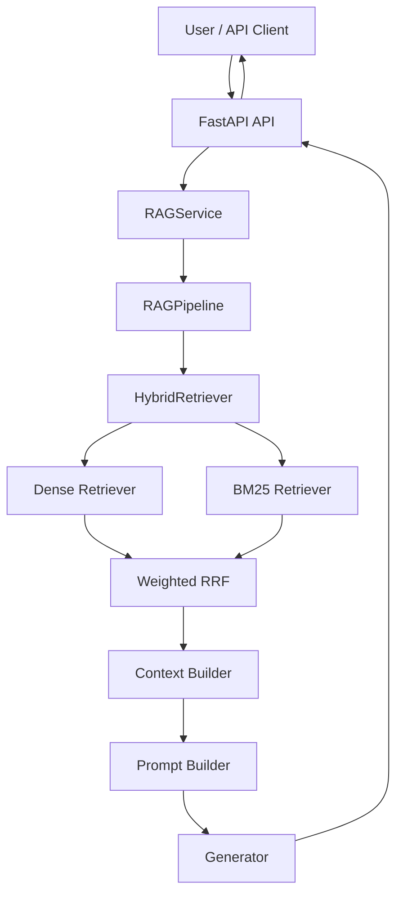
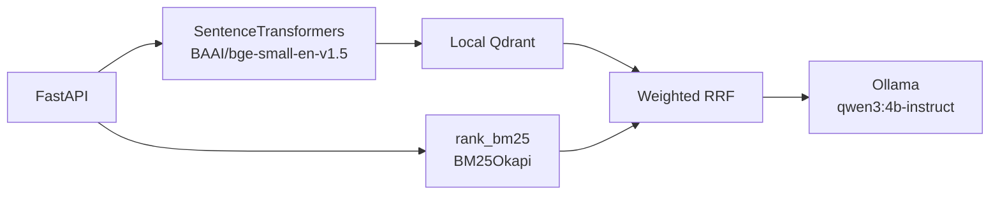
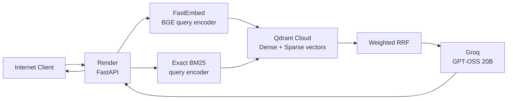

# System Architecture

## 1. Overview

Enterprise Knowledge Intelligence Platform is a production-minded Retrieval-Augmented Generation (RAG) system for technical documentation.

The v1 system uses a deterministic RAG pipeline:

```text
Query
  ↓
Retrieval
  ↓
Context Construction
  ↓
Prompt Construction
  ↓
Generation
  ↓
Answer + Citations
```

The project supports two runtime profiles:

- `local`: full local production-style stack.
- `cloud`: lightweight free-tier deployment stack.

Both profiles preserve the same application-level RAG flow while using different infrastructure adapters.

---

## 2. High-Level Architecture



The application layer is intentionally provider-independent. Infrastructure-specific behavior is isolated behind retriever and generator adapters.

---

## 3. Retrieval Pipeline

The v1 retrieval system combines dense semantic retrieval and lexical BM25 retrieval.

```text
Query
   ├── Dense retrieval
   └── BM25 retrieval
          ↓
     Weighted RRF
          ↓
        Top-K
          ↓
   Context Builder
```

Default fusion configuration:

```text
Dense weight       0.7
BM25 weight        0.3
RRF k              60
Retrieval top-k    10
```

The context builder limits the final context to:

```text
Maximum sources    6
Maximum tokens     4000
```

Adaptive retrieval was evaluated separately but was not enabled for the v1 production path. The deterministic hybrid pipeline remains the frozen v1 baseline.

---

## 4. Local Profile

The local profile preserves the original production-style architecture.



Main local components:

- SentenceTransformers BGE query encoder.
- Local Qdrant dense vector search.
- In-memory `rank_bm25` BM25 index.
- Application-side Weighted RRF.
- Ollama generation.
- Prometheus metrics.
- Grafana dashboards.

The local profile remains the canonical full-stack development and production-style reference implementation.

---

## 5. Cloud Profile

The cloud profile is optimized for free-tier deployment and lower runtime memory.



The deployed cloud stack uses:

- Render Free for FastAPI orchestration.
- FastEmbed with `BAAI/bge-small-en-v1.5`.
- Qdrant Cloud for dense and sparse retrieval.
- An exact `rank_bm25`-compatible sparse representation.
- Existing application-side Weighted RRF.
- Groq with `openai/gpt-oss-20b` for generation.

The cloud image does not install:

- PyTorch
- SentenceTransformers
- `rank_bm25`
- Ollama

This keeps the deployment image and runtime memory substantially smaller than the full local stack.

---

## 6. Exact BM25 Cloud Representation

The local BM25 implementation uses `rank_bm25.BM25Okapi`.

For the cloud profile, the same ranking behavior is represented using Qdrant sparse vectors.

Document-side BM25 components are precomputed and stored in Qdrant.

The runtime query encoder loads a deployment-owned artifact containing:

- vocabulary mappings,
- BM25 IDF values,
- tokenizer configuration,
- corpus statistics,
- sparse feature indices.

This allows cloud retrieval to reproduce the local BM25 ranking behavior without loading the full corpus or `rank_bm25` package at runtime.

The deployment artifact is stored at:

```text
deployment/artifacts/retrieval/rank-bm25-query-artifact-v1.json
```

---

## 7. Generation

Generation is performed only after retrieval and context construction.

The generation prompt requires the model to:

- answer using the provided sources,
- cite evidence using bracketed citations,
- avoid unsupported claims,
- report insufficient evidence when appropriate,
- acknowledge disagreement between sources when relevant.

Local profile:

```text
Ollama
qwen3:4b-instruct
```

Cloud profile:

```text
Groq
openai/gpt-oss-20b
```

Generation concurrency is intentionally bounded:

```text
MAX_CONCURRENT_GENERATIONS=1
GENERATION_TIMEOUT_SECONDS=120
```

---

## 8. API Layer

The public API is implemented with FastAPI.

Main endpoints:

```text
GET  /health
GET  /ready
GET  /metrics
POST /v1/query
GET  /docs
```

`/health` is a liveness endpoint.

`/ready` validates runtime dependencies for the active profile.

For the cloud profile it checks:

```text
RAG service
Qdrant Cloud
Groq
```

Input validation rejects invalid requests before they enter the RAG pipeline.

---

## 9. Observability and Production Hardening

The API includes:

- request IDs,
- structured request logging,
- Prometheus metrics,
- readiness checks,
- dependency failure normalization,
- generation timeout handling,
- generation admission control,
- query length validation,
- bounded generation concurrency.

Prometheus metrics include HTTP, retrieval, generation, and RAG query statistics.

---

## 10. Deployment

The public v1 deployment is available at:

```text
https://enterprise-kip-api.onrender.com
```

Interactive API documentation:

```text
https://enterprise-kip-api.onrender.com/docs
```

Cloud deployment path:

```text
Internet
   ↓
Render Free
   ↓
FastAPI
   ├── FastEmbed
   ├── BM25 query encoder
   ├── HybridRetriever
   │
   ├── Qdrant Cloud
   │     ├── BGE dense vectors
   │     └── exact BM25 sparse vectors
   │
   └── Groq
         ↓
Answer + Citations
```

Render uses:

```text
docker/Dockerfile.api.cloud
requirements-cloud.txt
```

The Docker entrypoint honors the platform-provided `PORT` while preserving port `8000` as the local default.

---

## 11. Runtime Profiles

| Component | Local | Cloud |
|---|---|---|
| API | FastAPI | FastAPI |
| Dense encoder | SentenceTransformers | FastEmbed |
| Dense index | Local Qdrant | Qdrant Cloud |
| BM25 | `rank_bm25` | Qdrant sparse BM25 |
| Fusion | Weighted RRF | Weighted RRF |
| Generator | Ollama | Groq |
| Model | `qwen3:4b-instruct` | `openai/gpt-oss-20b` |
| Metrics | Prometheus | Prometheus |
| Deployment | Docker Compose | Render |

The profiles intentionally share the same application-level retrieval and generation contracts.

---

## 12. Frozen v1 Boundary

The following capabilities are intentionally outside the deterministic v1 production path:

- automatic adaptive retrieval routing,
- autonomous LangGraph agent behavior,
- dynamic retrieval strategy selection,
- uncontrolled multi-query expansion.

These capabilities may be explored in later versions but are not required for the v1 production baseline.

The v1 priority is:

```text
reproducibility
→ measurable retrieval quality
→ grounded generation
→ predictable failure behavior
→ deployability
```
